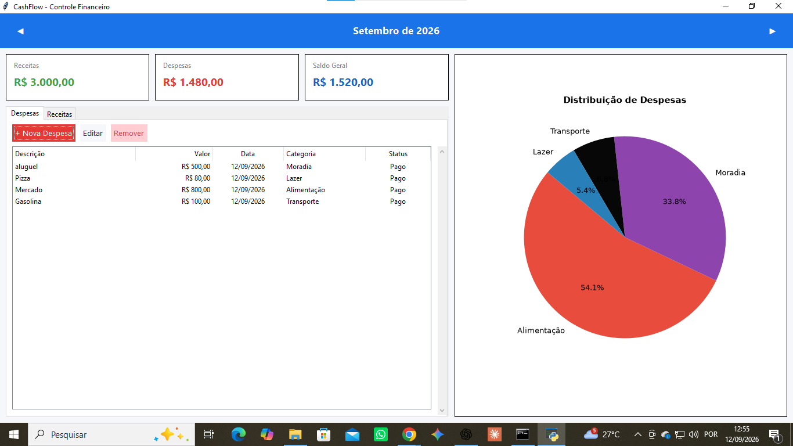

# Cashflow — Controle Financeiro Pessoal

O **Cashflow** é uma aplicação desktop que desenvolvi em Python para praticar desenvolvimento de software e banco de dados através de um projeto funcional.

A proposta do sistema é facilitar o controle financeiro pessoal, permitindo registrar receitas e despesas, acompanhar o saldo e visualizar como os gastos estão distribuídos.

Este projeto faz parte do meu processo de aprendizado em desenvolvimento de sistemas e banco de dados.

## Funcionalidades

- Cadastro de receitas e despesas
- Cálculo automático do saldo
- Armazenamento local dos dados
- Consulta das movimentações financeiras
- Filtro por mês
- Visualização de gastos através de gráficos
- Interface gráfica para utilização do sistema

## Tecnologias utilizadas

- **Python** — desenvolvimento da aplicação
- **Tkinter** — interface gráfica
- **SQLite** — armazenamento e persistência dos dados
- **Matplotlib** — geração dos gráficos

## O que pratiquei neste projeto

Durante o desenvolvimento do Cashflow, trabalhei principalmente com:

- Lógica de programação
- Manipulação e persistência de dados
- Operações com banco de dados SQLite
- Desenvolvimento de interfaces gráficas
- Organização de código em Python
- Geração e apresentação de dados em gráficos

## Demonstração

Abaixo está a tela principal do CashFlow com dados de exemplo:


## Como executar

Clone este repositório:

```bash
git clone https://github.com/syryusblack22/cashflow.git
